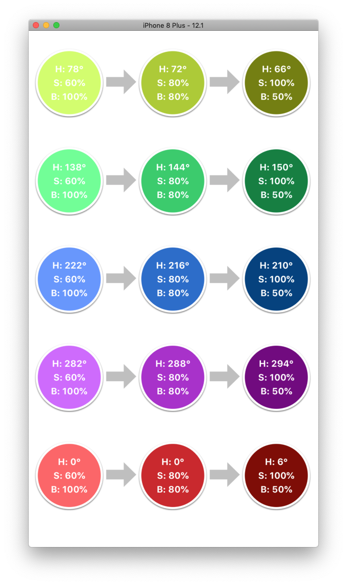

#  Color Transform

Example code for the blog post: [UIColor + Transformed](http://robincharlton.me/blog/uicolor-transformed)

Demonstrates the use of extension UIColor+Transform to automatically generate lighter and darker colors.

